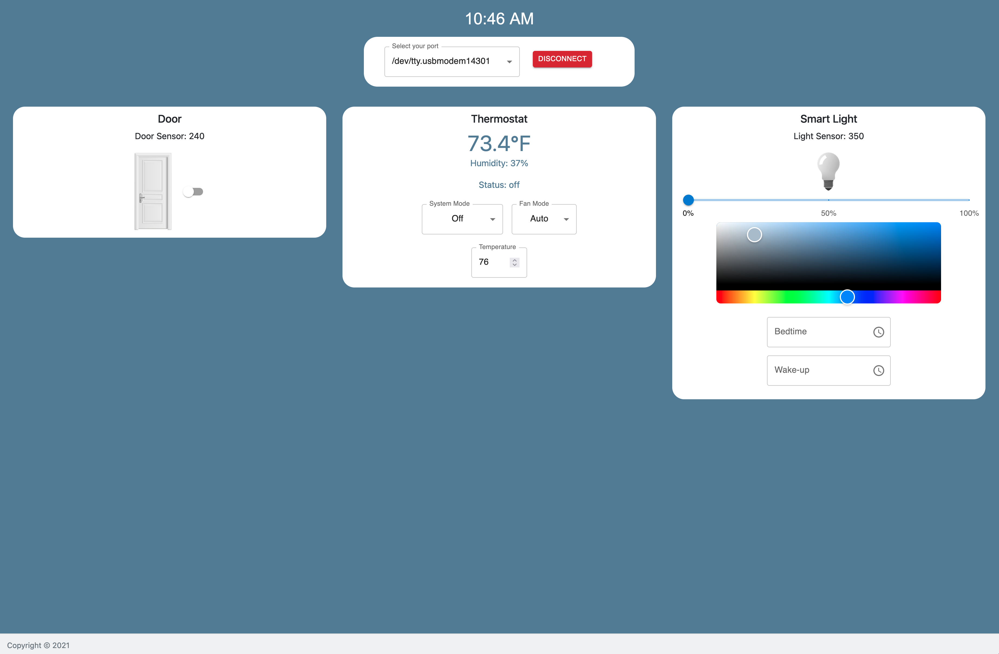

# Homi - A Smart Home Hub

# 1 Description

Utilized a MongoDB, Express, React, Node (MERN) stack to create a smart home web application for 

- monitoring temperature and humidity
- controlling a thermostat and a lighting system
- opening/closing a door
- simulating power consumption

The server will connect to a Particle IoT device to read in sensor data.

This design is composed of three components:

### IoTSense

IoTSense is the embedded device aspect of the code. This contains the Particle code that can be flashed to a device. The device used the following components:

- Photoresistor (Port A0)
- Photoresistor (Port A2)
- DHT 11 (Port D2)

The connections can be seen here

<p align="center">
  <a href="docs/img/Particle-Device.png">
  	 
  </a>
</p>

Testing performed with the [Argon board](https://store.particle.io/products/argon-kit?_pos=2&_sid=7bc4f6ba0&_ss=r)

### Localhost

A locally run server that communicates with the particle device over serial.

<p align="center">
  <a href="docs/img/Localhost.png">
     
  </a>
</p>
 
### AWS

A web app that can be run from an AWS server that will communicate with the device over cloud communication.

# 2 Getting Started

## Dependencies

### Node.js

Go [Here](https://nodejs.org/en/download/) to download the correct installer and follow the instructions to install.

### MongoDB

Go [Here](https://docs.mongodb.com/manual/installation/) to download MongoDB.

Note: Make sure the MongoDB service is started prior to continuing.

# 3 Running the Localhost Server

All of the server dependencies will need to be installed. This can be done by running the following command via the command line from the [Localhost](src/Localhost) directory.

```
$ npm install
```

After running, you should be able to start the server using

```
$ npm start
```

# 4 Authors

- Jake Summerville
- Martin Lopez
- Diego Moscoso


